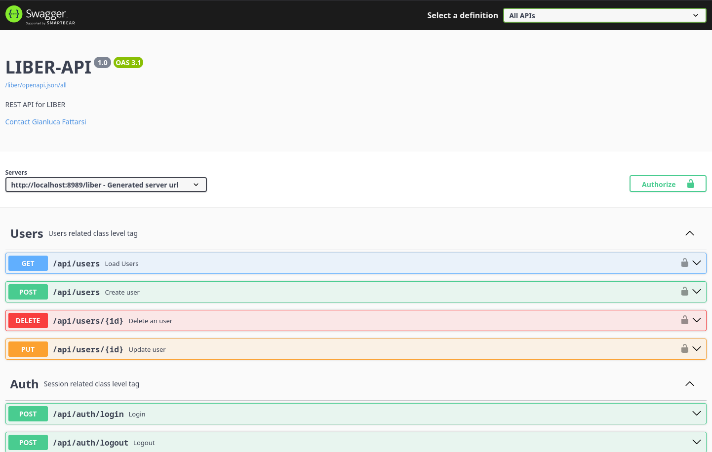
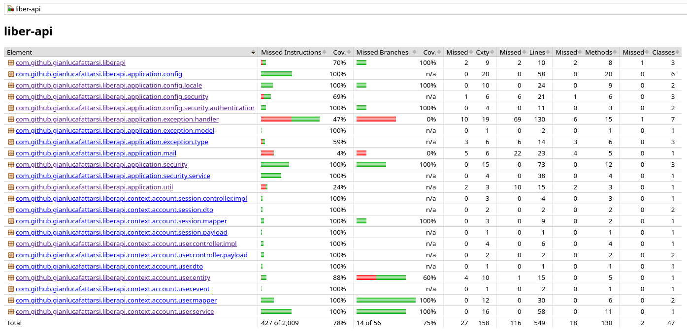

# Liber API

This is a project made in Spring Boot that contains the server-side part. It exposes webapi with
which client applications (Android, iOS, webApp, etc...) can interface to exchange information.
Frameworks and programming methodologies used:

** [Spring Boot](https://spring.io/projects/spring-boot)**

Spring Boot makes it easy to create stand-alone, production-grade Spring based Applications that you
can "just run".
Features

- Create stand-alone Spring applications
- Embed Tomcat, Jetty or Undertow directly (no need to deploy WAR files)
- Provide opinionated 'starter' dependencies to simplify your build configuration
- Automatically configure Spring and 3rd party libraries whenever possible
- Provide production-ready features such as metrics, health checks, and externalized configuration
- Absolutely no code generation and no requirement for XML configuration

Project is generated with [Spring Initializr](https://start.spring.io/) and the following
dependencies were used:

- **Spring Data JPA**

  *Persist data in SQL stores with Java Persistence API using Spring Data and Hibernate.*

  Application use hibernate configured in [application.properties](src/main/resources/application.properties) to handling data persistence.
  Using SQL ansi allows you to change the database according to your needs. Some of the databases tested in this project are: MariaDB and PostgreSQL.
  The application is divided into layers and as far as JPA is concerned all entities are configured in the `entity` package managed with the `@Entity`
  annotation. An example is the [User](src/main/java/com/github/gianlucafattarsi/liberapi/context/account/user/entity/User.java) class. Repositories
  (the only classes that handle data access) are configured in the `repository` package and managed with the `@Repository` annotation. An example is
  the [UserRepository](src/main/java/com/github/gianlucafattarsi/liberapi/context/account/user/repository/UserRepository.java) class.


- **Spring Web**

  *Build web, including RESTful, applications using Spring MVC. Uses Apache Tomcat as the default
  embedded container.*


- **Spring Security**

  *Highly customizable authentication and access-control framework for Spring applications.*


- **Validation**

  *Bean Validation with Hibernate validator.*


- **Java Mail Sender**

  *Send email using Java Mail and Spring Framework's JavaMailSender.*

  In the specific case of sending the email during user registration, it is possible to configure all
  the parameters necessary for Java Mail to send in the following way on [application.preperties](src/main/resources/application.properties)):
  ```properties
  send.registration.mail=false
  spring.mail.host=smtp.gmail.com
  spring.mail.port=587
  spring.mail.username=${MAIL_USERNAME}
  spring.mail.password=${MAIL_PASSWORD}
  spring.mail.properties.mail.smtp.starttls.enable=true
  spring.mail.properties.mail.smtp.starttls.required=true
  spring.mail.properties.mail.smtp.auth=true
  spring.mail.properties.mail.smtp.connectiontimeout=5000
  spring.mail.properties.mail.smtp.timeout=5000
  spring.mail.properties.mail.smtp.writetimeout=5000
  ```
  Using JavaMailSender you can then create the message and send the email. An example can be found in
  the [UserService](src/main/java/com/github/gianlucafattarsi/liberapi/context/account/user/service/UserService.java)
  class in the `createNewUser` method


- **OAuth2 Resource Server**

  *Spring Boot integration for Spring Security's OAuth2 resource server features.*

** WebAPI REST**
** Swagger**



The project exposes all operations through RESTApi with which all clients can interact for data exchange at url http://localhost:8989/liber/swagger-ui/index.html.

All endpoints and their DTOs are documented using the swagger library. An example is the [UsersApi](src/main/java/com/github/gianlucafattarsi/liberapi/context/account/user/controller/UsersApi.java) class with its [UserDTO](src/main/java/com/github/gianlucafattarsi/liberapi/context/account/user/dto/UserDTO.java) DTO.

At the URL http://localhost:8989/liber/openapi.json you can download the
``openapi.json`` file which contains the schema of all the endpoints present in the application in the openapi 3.1.0 specification.

"*The OpenAPI Specification (OAS) defines a standard, language-agnostic interface to HTTP APIs which allows both humans and computers to discover and understand the capabilities of the service without access to source code, documentation, or through network traffic inspection. When properly defined, a consumer can understand and interact with the remote service with a minimal amount of implementation logic.*" [[1]](#1)

** JWT**

"*JSON Web Token (JWT) is an open standard (RFC 7519) that defines a compact and self-contained way for securely transmitting information between parties as a JSON object. This information can be verified and trusted because it is digitally signed. JWTs can be signed using a secret (with the HMAC algorithm) or a public/private key pair using RSA or ECDSA.*" [[2]](#2)

The existing web APIs are accessible via JWT authentication. Logging in returns a JWT that can be used to call all secure web APIs (by adding the "Authentication" header with the value "Bearer JWT") and a refresh token, which can be used to obtain a new JWT without having to log in again.

** Gradle**

The chosen build system is Gradle based on Groovy. The [build.gradle](build.gradle) file contains all the settings and tasks created to manage the application's dependencies and configuration.

** Testing**

The [test](src/test) directory contains all the classes needed to run all the tests needed to cover the use cases. Running the command
`./gradlew test` you can run all the tests and check the coverage of the code. The tests result are available in the [test-report](test-report) directory in HTML format ([index.html](test-report/index.html)). Using GitHub as CI/CD, the tests are run automatically on each commit and the results are available in the [Actions](https://github.com/gianlucafattarsi/liber/actions) tab.

To complete the testing phase, [JaCoCo](https://www.eclemma.org/jacoco/) is integrated, a code coverage library that allows you to check the code coverage, its complexity and quality. All test results, after launch the command `./gradlew jacocoTestReport`, are available in the test directory under `build/reports/jacoco/` in HTML, CSV or XML format.



## Requirements

For building and running the application you need:

- [JDK 24](https://openjdk.org/projects/jdk/24/)
- Gradle 8.14 ( included as wrapper )

## Running the application locally

There are several ways to run a Spring Boot application on your local machine. One way is to execute
the `main` method in
the [LiberApiApplication](src/main/java/com/github/gianlucafattarsi/liberapi/LiberApiApplication.java)
class from your IDE.

Alternatively you can use **gradle wrapper** like so:

**Linux**

```shell
./gradlew bootRun --args=''
```

**Windows**

```shell
./gradlew.bat bootRun --args=''
```

All available arguments are contained
in [application.properties](src/main/resources/application.properties) between tags "${" and "}".
For example:

```properties
spring.profiles.active=${SPRING_PROFILES_ACTIVE}
spring.application.name=liber-api
spring.main.allow-circular-references=true
# ===============================
# = DATA SOURCE
# DB_URL, DB_USERNAME, DB_PASSWORD are set in the active profile
# ===============================
spring.datasource.url=${DB_URL}
spring.datasource.username=${DB_USERNAME}
spring.datasource.password=${DB_PASSWORD}
```

Possible `bootRun` arguments are `SPRING_PROFILES_ACTIVE`, `DB_URL`, `DB_USERNAME` and `DB_PASSWORD`
used in this way

**Linux**

```shell
./gradlew bootRun --args='--SPRING_PROFILES_ACTIVE=dev --DB_URL=jdbc:mariadb://localhost:3306/liber --DB_PASSWORD=mypassword --DB_USERNAME=myuser'
```

## Build with

### 🔨 Tools

*  IntelliJ
*  Postman

### 🚍 Communication

*  HTTP
*  REST

### 🧰 Version Control

*  Git
*  GITHub

### ☕ Java

*  Java
*  Spring Boot
*  Hibernate
*  JUnit
*  Mockito
*  Lombok
*  Mapstruct

### 💾 Database

*  PostgreSQL
*  MariaDB

### 🤿 DevOps

*  Bash
*  Docker
*  Nginx

## References

<a id="1">[1]</a>
OpenAPI Specification.
Go to [url](https://swagger.io/specification/) for more info

<a id="2">[2]</a>
JSON Web Tokens.
Go to [url](https://jwt.io/) for more info